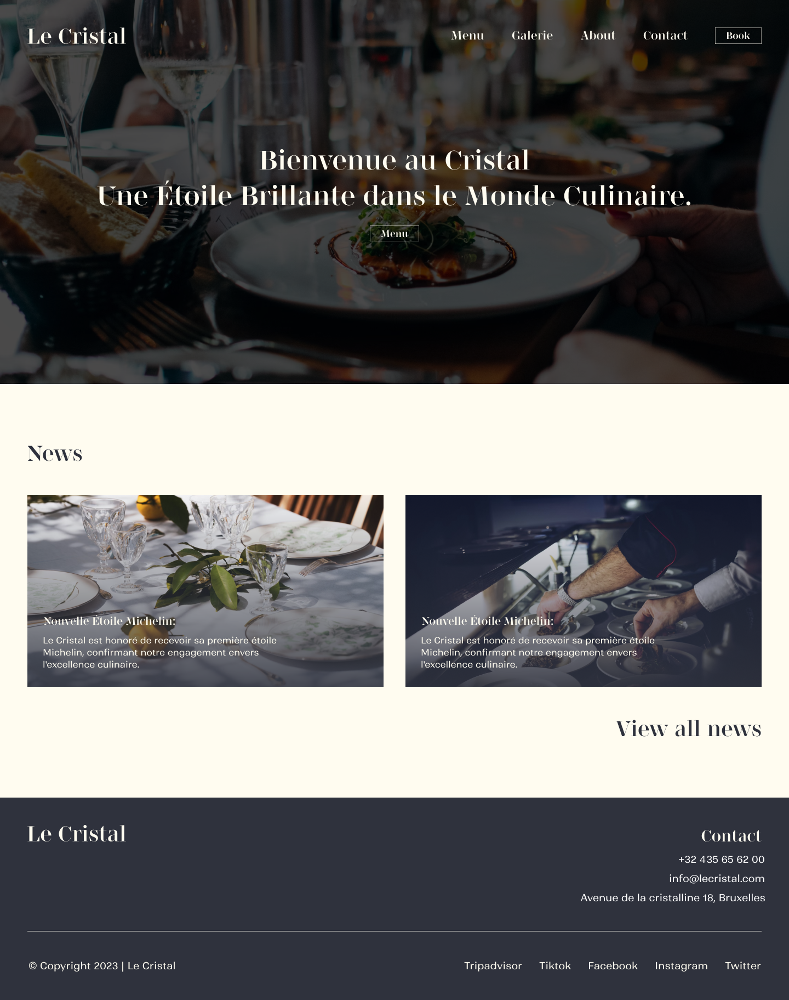
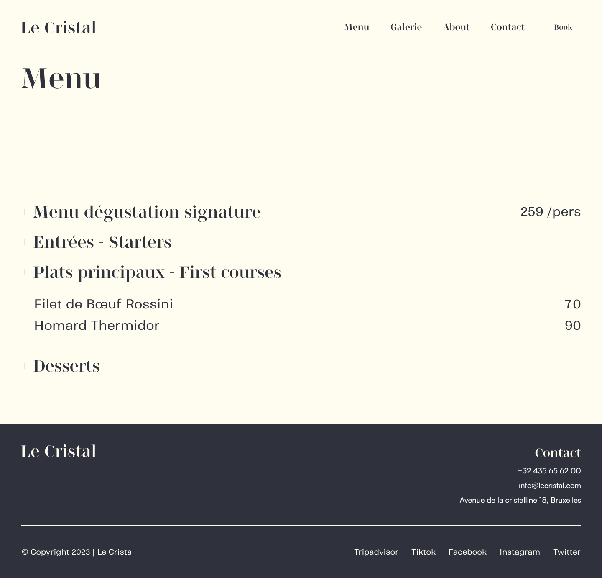
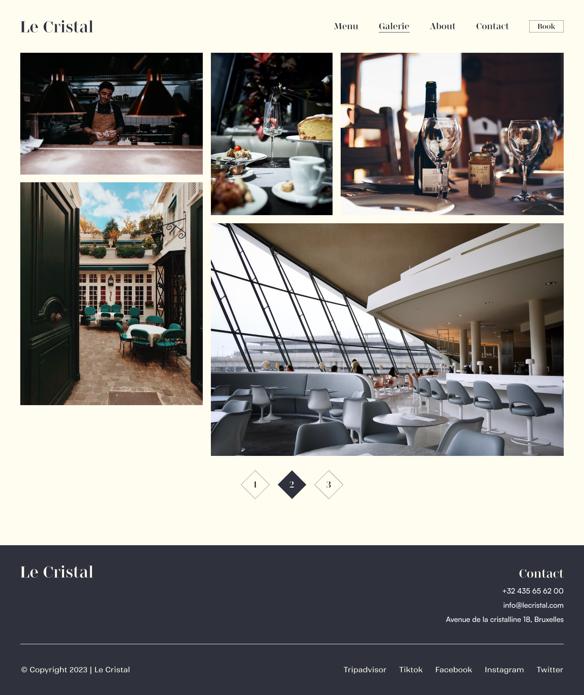
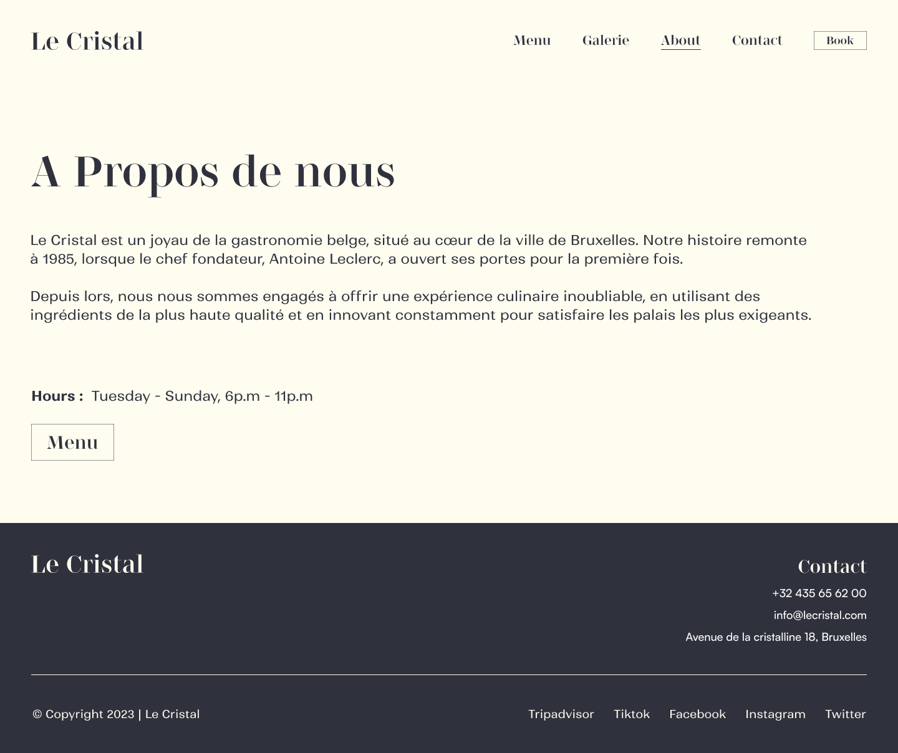
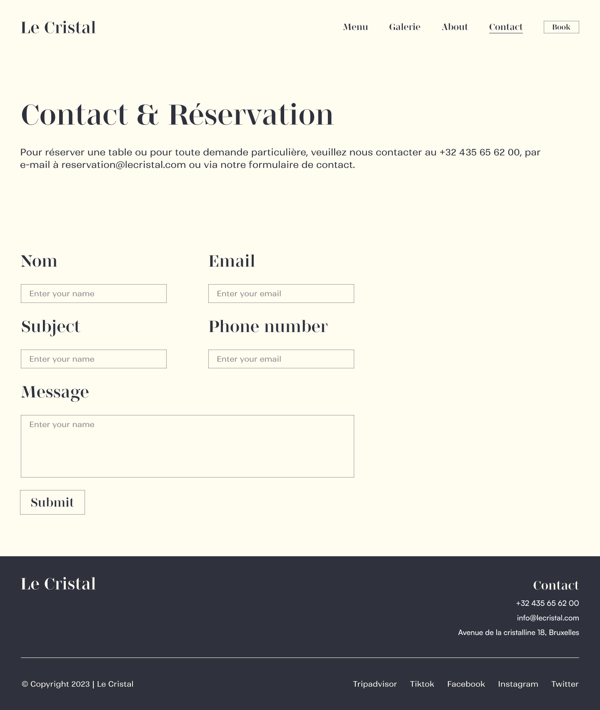
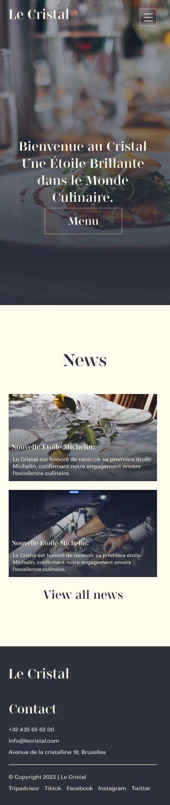
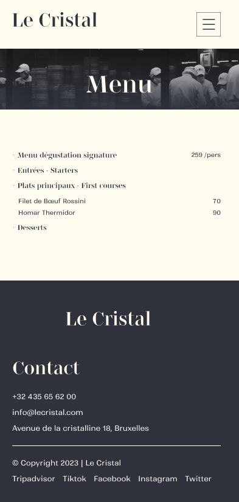

# Restaurant challenge

Challenge: Concept website for restaurant using tailwindcss

- Timing: 4 days
- Goals: Training positioning with tailwindcss or bootstrap
- Solo challenge

## See it live 

Click here to see the [live version](https://bschutters.github.io/restaurant-css-framework/)

## Technologies Used

Check the pkg.json for a complete list. But the most notable ones are:

- `vite` 
- `html` 
- `css`
- `tailwindcss`

## Screenshots
- Desktop
  
  
  
  
  

  - Mobile 

  
  

---

&copy; 2023